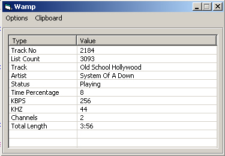



## Wamp

### Description

Stores selected Winamp track info to the clipboard, for easy pasting into chatrooms, messengers etc
 
### More Info
 
Works with winamps 1,2,4,5. not tested on 3

             |
---                |---
**Submitted On**   |2005-06-07 20:47:32
**By**             |[telly](https://github.com/Planet-Source-Code/PSCIndex/blob/master/ByAuthor/telly.md)
**Level**          |Intermediate
**User Rating**    |4.0 (12 globes from 3 users)
**Compatibility**  |VB 3\.0, VB 4\.0 \(32\-bit\), VB 5\.0, VB 6\.0
**Category**       |[Miscellaneous](https://github.com/Planet-Source-Code/PSCIndex/blob/master/ByCategory/miscellaneous__1-1.md)
**World**          |[Visual Basic](https://github.com/Planet-Source-Code/PSCIndex/blob/master/ByWorld/visual-basic.md)
**Archive File**   |[Wamp191995812005\.zip](https://github.com/Planet-Source-Code/telly-wamp__1-62028/archive/master.zip)

